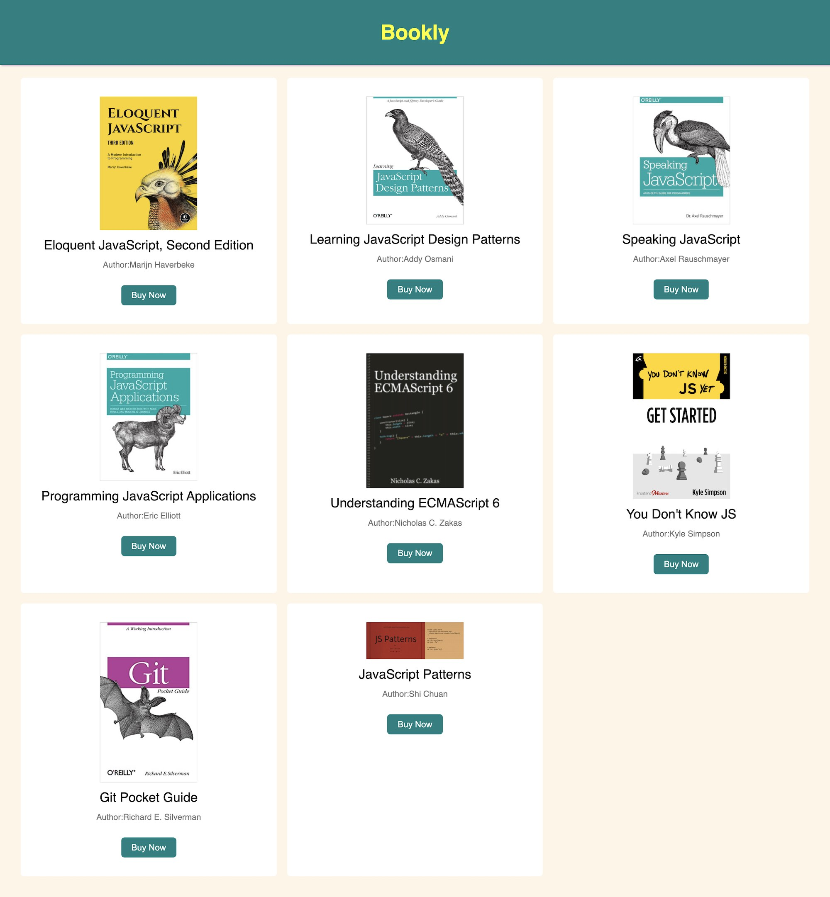

writeCode

#### Follow the instructions to complete this exercise:

1. You will find all the code for this exercise in the `code` folder.
2. Write HTML, CSS and JavaScript in the respective files.
3. Create an app like the layout given below. Find the data to create the app just below the layout.

